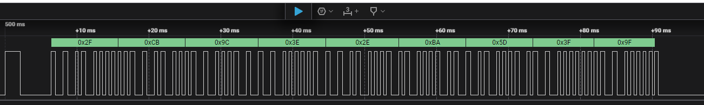

# Zemismart RF 433 Signal Analyzer

Zemismart RF 433 Remote Control / USB Dongle Signal Analyzer (Low Level Analyzer Plugin for Saleae Logic2)



Unfortunately, the encoding algorithm is unknown...

Documentation for the Saleae Logic Analyzer SDK can be found here:
https://github.com/saleae/SampleAnalyzer

That documentation includes:

- Detailed build instructions
- Debugging instructions
- Documentation for CI builds
- Details on creating your own custom analyzer plugin

## Building Analyzer

CMake and a C++ compiler are required. Instructions for installing dependencies can be found here:
https://github.com/saleae/SampleAnalyzer

The fastest way to use this analyzer is to download a release from github. Local building should only be needed for making your own changes to the analyzer source.

### Windows

```bat
mkdir build
cd build
cmake .. -A x64
cmake --build .
:: built analyzer will be located at SampleAnalyzer\build\Analyzers\Debug\SimpleSerialAnalyzer.dll
```

### MacOS

```bash
mkdir build
cd build
cmake ..
cmake --build .
# built analyzer will be located at SampleAnalyzer/build/Analyzers/libSimpleSerialAnalyzer.so
```

### Linux

```bash
mkdir build
cd build
cmake ..
cmake --build .
# built analyzer will be located at SampleAnalyzer/build/Analyzers/libSimpleSerialAnalyzer.so
```
